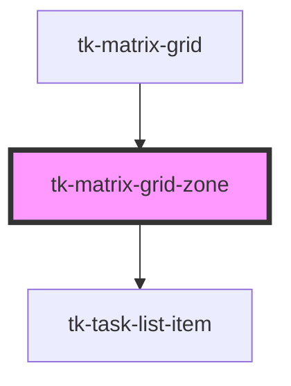

# tk-matrix-grid-zone

<!-- Auto Generated Below -->

## Properties

| Property      | Attribute      | Description | Type     | Default     |
| ------------- | -------------- | ----------- | -------- | ----------- |
| `zoneCaption` | `zone-caption` |             | `any`    | `undefined` |
| `zoneNumber`  | `zone-number`  |             | `number` | `undefined` |

## Events

| Event          | Description | Type               |
| -------------- | ----------- | ------------------ |
| `taskItemDrop` |             | `CustomEvent<any>` |

## Methods

### `reloadMatrixGridZone() => Promise<void>`

#### Returns

Type: `Promise<void>`

## Dependencies

### Used by

 - [tk-matrix-grid](../matrix-grid)

### Depends on

- [tk-task-list-item](../task-list-item)

### Graph

----------------------------------------------

*Built with [StencilJS](https://stenciljs.com/)*
