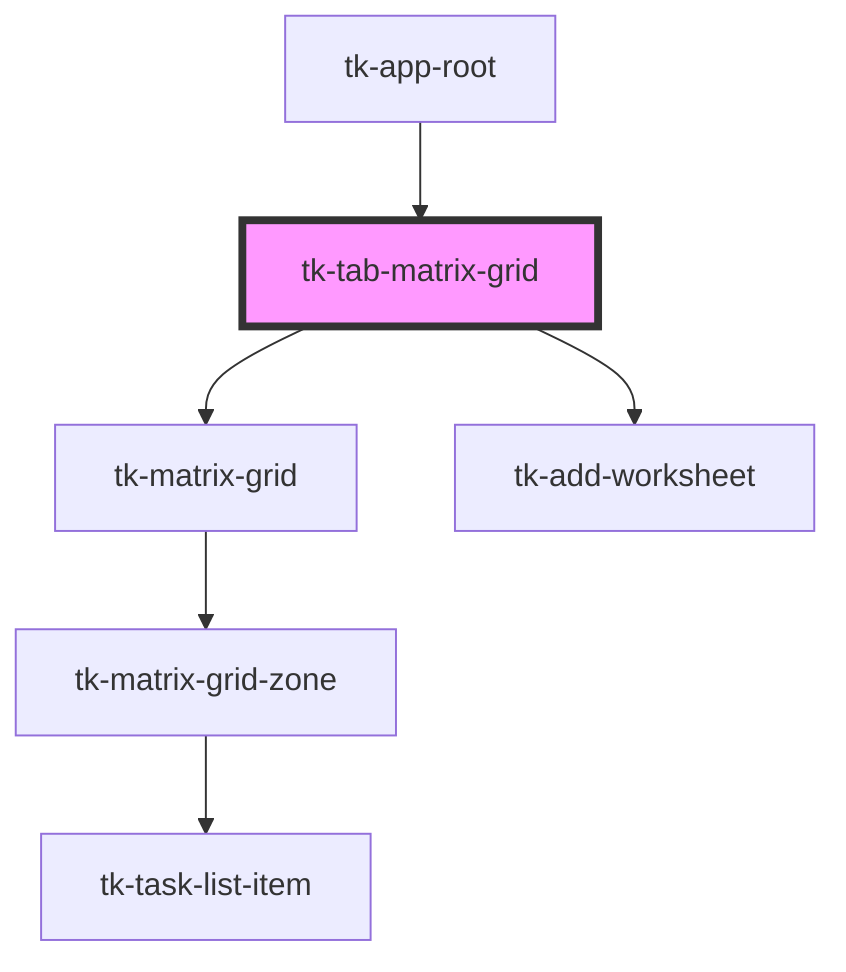

# tk-tab-matrix-grid

<!-- Auto Generated Below -->

## Events

| Event                     | Description | Type               |
| ------------------------- | ----------- | ------------------ |
| `closeWorksheetRequested` |             | `CustomEvent<any>` |
| `currentWorksheetUpdated` |             | `CustomEvent<any>` |

## Dependencies

### Used by

 - [tk-app-root](../../app/tk-app-root)

### Depends on

- [tk-matrix-grid](../matrix-grid)
- [tk-add-worksheet](../add-worksheet)

### Graph

----------------------------------------------

*Built with [StencilJS](https://stenciljs.com/)*
