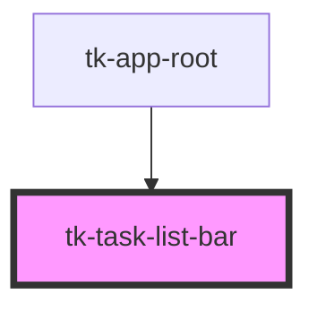

# tk-task-list-bar

<!-- Auto Generated Below -->

## Events

| Event                 | Description | Type               |
| --------------------- | ----------- | ------------------ |
| `bulkAddDialogClosed` |             | `CustomEvent<any>` |
| `targetZoneUpdated`   |             | `CustomEvent<any>` |
| `taskItemUpdated`     |             | `CustomEvent<any>` |

## Dependencies

### Used by

 - [tk-app-root](../../app/tk-app-root)

### Graph

----------------------------------------------

*Built with [StencilJS](https://stenciljs.com/)*
