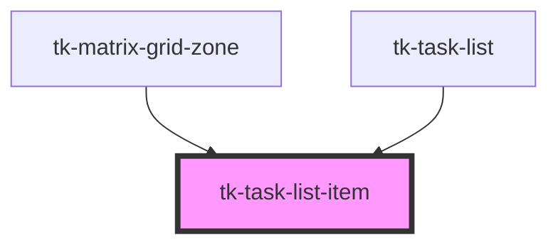

# tk-task-list-item

<!-- Auto Generated Below -->

## Properties

| Property   | Attribute   | Description | Type  | Default     |
| ---------- | ----------- | ----------- | ----- | ----------- |
| `taskItem` | `task-item` |             | `any` | `undefined` |

## Events

| Event                   | Description | Type               |
| ----------------------- | ----------- | ------------------ |
| `deleteTaskItemSuccess` |             | `CustomEvent<any>` |
| `taskItemUpdated`       |             | `CustomEvent<any>` |

## Methods

### `clearEdit() => Promise<void>`

#### Returns

Type: `Promise<void>`

## Dependencies

### Used by

 - [tk-matrix-grid-zone](../matrix-grid-zone)
 - [tk-task-list](../task-list)

### Graph

----------------------------------------------

*Built with [StencilJS](https://stenciljs.com/)*
