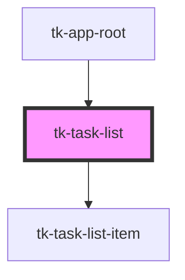

# tk-task-list

<!-- Auto Generated Below -->

## Events

| Event            | Description | Type               |
| ---------------- | ----------- | ------------------ |
| `taskItemDrop`   |             | `CustomEvent<any>` |
| `taskItemLoaded` |             | `CustomEvent<any>` |

## Methods

### `reloadTaskList() => Promise<void>`

#### Returns

Type: `Promise<void>`

## Dependencies

### Used by

 - [tk-app-root](../../app/tk-app-root)

### Depends on

- [tk-task-list-item](../task-list-item)

### Graph

----------------------------------------------

*Built with [StencilJS](https://stenciljs.com/)*
